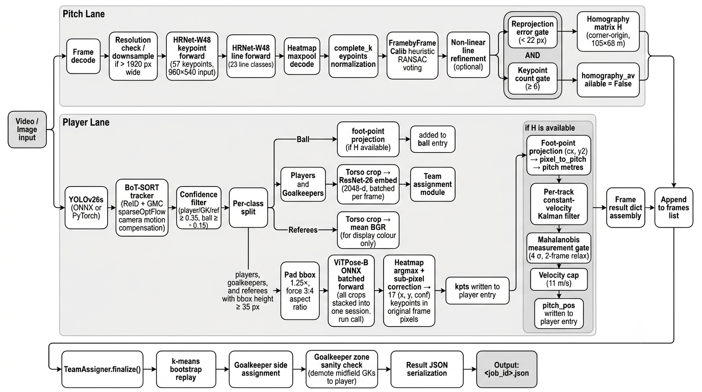

# FORMA 3D

> Convert broadcast football footage into interactive 3D tactical reconstructions — in your browser, no extra software needed.

<!-- BANNER IMAGE — replace this comment with your screenshot -->
<!--  -->

---

## What is FORMA 3D?

FORMA 3D is a full-stack football analysis tool. You upload a broadcast clip or a single still image. A multi-stage computer-vision and machine-learning pipeline runs automatically on the server — detecting every player, tracking them across every frame, placing them on a FIFA-standard 105 × 68 m pitch, clustering them into teams by kit, estimating their 2D body poses, and lifting them into 3D SMPL-X body meshes. The result opens as a live interactive viewer in your browser.

There are two views. The **Tactical tab** shows mannequins on a 3D pitch, perfectly synced to the source video playback, so you can scrub through the clip and watch players move. The **Mesh tab** replaces mannequins with full 3D SMPL-X bodies — real body shape and pose reconstructed per player per frame — with camera presets, a drawing toolkit for tactical annotations, and MP4 recording.

<!-- DEMO GIF or VIDEO — replace this comment -->
<!--  -->
<!-- Or: [](https://youtu.be/YOUR_LINK) -->

---

## Features

### Upload & Processing
- Upload any broadcast football clip (MP4, AVI, MOV, MKV) or a single still image (JPG, PNG, WebP, BMP)
- Pipeline starts automatically on upload with a live progress bar
- Real-time log terminal streams every backend log line directly into the browser
- Processing is asynchronous — the browser polls for updates while the server runs in the background

### Tactical Tab

<!--  -->

- Every detected player, goalkeeper, referee, and ball placed as a 3D mannequin on a FIFA 105 × 68 m pitch
- Mannequin colours match actual detected kit colours — no manual colour picking
- 3D view synced to source video: scrub the video and mannequins move in real time
- Click any mannequin to reassign: Team A, Team B, Goalkeeper, Referee, or Unassigned
- Ball tracked and displayed separately

### Mesh Tab

<!--  -->

- SMPL-X 3D body meshes per player reconstructed from video using GVHMR (SIGGRAPH Asia 2024)
- Camera presets: Bird's Eye, Broadcast, Sideline, Corner
- Toggles: Wireframe, Player ID labels, Tilt, Yaw correction
- Player heading direction tracked from GVHMR's global yaw estimate including backpedalling detection

### Tactical Drawing Tools

<!--  -->

- Draw directly on the 3D pitch plane in the browser
- **Arrows** — direction indicators with configurable colour, glow, and width
- **Lines** — straight lines between any two pitch points
- **Paths** — freehand multi-point paths
- **Animated Paths** — paths with a travelling pulse animation for showing movement sequences
- **Zones** — filled polygons for marking pressure zones, defensive blocks, or set piece areas
- **Connecting Lines** — link specific players to each other (passing lanes, pressing triggers)
- All tools have glow, colour, width, and opacity controls

### Export & Recording
- **Record MP4** — captures the Three.js canvas as WebM, transcodes server-side to MP4
- **Export Videos (5 stages)** — server-side OpenCV renders five annotated overlay videos from the original footage:
  - Detection: bounding boxes + track IDs coloured by role
  - Clustering: bounding boxes coloured by team
  - Pitch keypoints: PnLCalib keypoints + detected line segments
  - PnLCalib: keypoints + lines + homography grid + bird's-eye minimap inset
  - Pose: ViTPose 17-joint skeleton overlay

---

## Pipeline

### Pass 1 — Detection, Tracking, Homography, Team Clustering, Pose

<!--  -->

Every processed frame runs two parallel lanes simultaneously.

**Pitch Lane:** HRNet-W48 detects 57 pitch keypoints and 23 line classes. Heatmaps are decoded to sub-pixel coordinates. `FramebyFrameCalib` runs heuristic RANSAC voting to solve a homography, optionally refined against the line detections. The result is accepted only if reprojection error < 22 px and ≥ 6 keypoints were detected, producing a 3×3 matrix H mapping image pixels to corner-origin FIFA pitch coordinates (105 × 68 m).

**Player Lane:** YOLOv8s-v26 detects players, goalkeepers, referees, and the ball. BoT-SORT with ReID and sparse optical flow camera motion compensation tracks them across frames. Detections are split by class: players and goalkeepers go through ResNet-26 embedding for team clustering; referees have their torso colour sampled for display; all three plus ball get foot-point projected to pitch metres through H (when available), smoothed by a per-track constant-velocity Kalman filter with a Mahalanobis gate and 11 m/s velocity cap. All qualifying detections (bbox height ≥ 35 px) go through ViTPose-B ONNX batched inference for 17-joint 2D pose.

After all frames: TeamAssigner finalises k-means team clusters, assigns goalkeepers by pitch side, and demotes any goalkeeper track found in the midfield zone to player.

### Pass 2 — SMPL-X Mesh Lifting (GVHMR)

<!--  -->

Triggered separately after Pass 1. Reads the Pass 1 JSON and for each qualifying track (length ≥ 8 frames, median bbox height ≥ 10 px): segments the track bridging gaps ≤ 6 frames with linear interpolation, reads source video frames, runs HMR2 ViT-H to extract (F, 1024) image features, packs those features with the ViTPose keypoints from Pass 1 and estimated camera intrinsics, and runs GVHMR's transformer with `static_cam=True` to get per-frame SMPL-X parameters. Yaw is extracted per frame then zeroed before the SMPL-X vertex forward pass. Vertices are floor-translated so feet sit at Y=0, X-mirrored for Three.js handedness, and encoded as base64 float16. The viewer applies `mesh.rotation.y = gvhmr_yaw + calibration_offset` to restore real body heading per track.

---

## Quick Start

```bash
# 1. Clone with submodules
git clone --recurse-submodules https://github.com/YOUR_USERNAME/forma3d.git
cd forma3d/app

# 2. Virtual environment
python -m venv .venv
.venv\Scripts\Activate.ps1        # Windows
# source .venv/bin/activate        # Linux / Mac

# 3. PyTorch — pick your variant
# NVIDIA CUDA 12.1
pip install torch torchvision --index-url https://download.pytorch.org/whl/cu121
# CPU only
pip install torch torchvision

# 4. Dependencies
pip install -r requirements.txt

# 5. Place model weights in models/ (see docs/SETUP.md for download links)

# 6. Run
python main.py
# Open http://localhost:8000
```

Full environment setup, GVHMR checkpoints, SMPL-X model files, pytorch3d build instructions, and deployment scripts are in **[docs/SETUP.md](docs/SETUP.md)**.

---

## Repository Layout

```
app/
├── main.py                  FastAPI server — all HTTP endpoints + SSE log broadcast
├── pipeline.py              Pass 1 — detection, tracking, homography, team, pose
├── pnl_homography.py        PnLCalib wrapper — HRNet forward, RANSAC solve, H output
├── team_assign.py           ResNet-26 embedding, PCA, k-means, vote-and-lock
├── pitch_filter.py          Per-track constant-velocity Kalman filter (2D pitch space)
├── pose.py                  ViTPose-B ONNX batched inference + heatmap decode
├── pose_post.py             Keypoint post-processing utilities
├── lift_gvhmr.py            Pass 2 — HMR2 features + GVHMR transformer → SMPL-X meshes
├── apply_mesh_features.py   Vertex floor-translation and base64 encoding utilities
├── video_export.py          Server-side OpenCV 5-stage overlay video renderer
├── runtime.py               Device selection, autocast, thread tuning, ONNX sessions
├── homography.py            Legacy homography backend (superseded by PnLCalib)
├── lift_motionbert.py       Legacy 3D pose lifter (superseded by GVHMR)
├── download_models.py       Helper script to fetch model weights
├── requirements.txt         Python dependencies
├── botsort_reid.yaml        BoT-SORT ReID + GMC sparseOptFlow config
├── setup_vast.sh            One-shot vast.ai GPU cloud setup
├── setup_mac.sh             One-shot Apple Silicon (M1/M2/M3) setup
├── setup_windows.ps1        One-shot Windows setup
│
├── static/
│   └── FORMA B.dc.html      Single-file Three.js browser app (~150 KB)
│
├── tests/
│   ├── test_resnet_teams.py
│   ├── test_siglip_teams.py
│   ├── check_equiv.py
│   └── kaggle_stage_test.py
│
├── docs/
│   ├── SETUP.md
│   └── assets/              Screenshots and pipeline diagrams
│
├── PnLCalib/                Git submodule — pitch keypoint + line detection
├── GVHMR/                   Git submodule — SMPL-X mesh lifting
├── MotionBERT/              Git submodule — legacy 3D pose lifter
│
├── models/                  Model weights — gitignored, see docs/SETUP.md
├── outputs/                 Pipeline outputs — gitignored
└── uploads/                 Uploaded clips — gitignored
```

---

## API Reference

| Method | Path | Description |
|--------|------|-------------|
| `GET` | `/` | Serve the browser app |
| `POST` | `/process` | Upload video or image, start Pass 1 → returns `job_id` |
| `GET` | `/status/{id}` | Poll Pass 1 progress |
| `GET` | `/result/{id}` | Stream Pass 1 result JSON |
| `POST` | `/process-mesh/{job_id}` | Start Pass 2 (GVHMR mesh lifting) |
| `GET` | `/status-mesh/{id}` | Poll Pass 2 progress |
| `GET` | `/result-mesh/{id}` | Stream Pass 2 mesh JSON |
| `POST` | `/export/{job_id}` | Start 5-stage video export |
| `GET` | `/status-export/{id}` | Poll export progress |
| `GET` | `/download-export/{id}/{stage}` | Download one overlay video |
| `POST` | `/transcode-to-mp4` | Accept browser WebM blob → return MP4 |
| `GET` | `/logs` | SSE stream of all backend log lines |

---

## Configuration

Key constants at the top of each file:

| File | Constant | Default | Description |
|------|----------|---------|-------------|
| `pipeline.py` | `PROCESS_EVERY_N` | `2` | Process every Nth frame |
| `pipeline.py` | `PERSON_MIN_CONF` | `0.35` | Min confidence for players/GK/ref |
| `pipeline.py` | `BALL_MIN_CONF` | `0.15` | Min confidence for ball |
| `pnl_homography.py` | `PNL_MAX_REP_ERR_PX` | `22.0` | Max reprojection error to accept H |
| `pnl_homography.py` | `PNL_MIN_KEYPOINTS` | `6` | Min keypoints to attempt solve |
| `team_assign.py` | `BOOTSTRAP_SAMPLES` | `120` | Crops before k-means fit |
| `team_assign.py` | `LOCK_VOTES` | `25` | Votes before team is locked |
| `pitch_filter.py` | `GATE_M` | `4.0` | Mahalanobis gate radius (metres) |
| `pitch_filter.py` | `MAX_SPEED` | `11.0` | Velocity cap (m/s) |
| `lift_gvhmr.py` | `MIN_TRACK_LEN` | `8` | Min track length for mesh lifting |
| `lift_gvhmr.py` | `VERTS_DTYPE_DEFAULT` | `"fp16"` | Vertex precision: fp16 / fp32 / off |
| `lift_gvhmr.py` | `MAX_TRACKS_DEFAULT` | `0` | 0 = lift all tracks |

---

## Output Files

All outputs land in `outputs/` (gitignored):

| File | Description |
|------|-------------|
| `<job_id>.json` | Pass 1 result — players, bboxes, pitch positions, keypoints, team colours |
| `<job_id>_mesh.json` | Pass 2 result — same + SMPL-X params and base64 vertices per player per frame |
| `<job_id>_detection.mp4` | Bboxes + track IDs coloured by role |
| `<job_id>_clustering.mp4` | Bboxes coloured by team |
| `<job_id>_keypoints.mp4` | PnLCalib keypoints + line segments |
| `<job_id>_pnlcalib.mp4` | Keypoints + lines + minimap inset |
| `<job_id>_pose.mp4` | ViTPose 17-joint skeleton overlay |

---

## Deployment

### vast.ai (recommended for GPU)
```bash
# On the instance (pytorch/pytorch:2.3.0-cuda12.1-cudnn8-devel image)
bash setup_vast.sh
```

### Apple Silicon (M1 / M2 / M3)
```bash
bash setup_mac.sh
```

### Windows
```powershell
.\setup_windows.ps1
```

---

## Known Limitations

- PnLCalib homography is per-frame with no temporal smoothing of the calibration itself. Player positions are Kalman-smoothed but pitch registration can jitter on fast camera pans or replays.
- GVHMR assumes `static_cam=True` — designed for fixed broadcast cameras, not hand-held or drone footage.
- SMPL-X mesh quality degrades for small or distant players (median bbox height < 10 px). These tracks are skipped automatically.
- MP4 canvas recording requires the browser tab to remain visible — `captureStream` returns black frames for hidden tabs.
- GVHMR requires pytorch3d which must be built from source on most setups. See `docs/SETUP.md`.

---

## Third-Party Components

| Component | Role | License |
|-----------|------|---------|
| [PnLCalib](https://github.com/mguti97/No-Bells-Just-Whistles) | Pitch homography | MIT |
| [GVHMR](https://github.com/zju3dv/GVHMR) | SMPL-X mesh lifting (SIGGRAPH Asia 2024) | See repo |
| [MotionBERT](https://github.com/Walter0807/MotionBERT) | Legacy 3D pose lifter | MIT |
| [Ultralytics YOLOv8](https://github.com/ultralytics/ultralytics) | Detection + BoT-SORT tracking | AGPL-3.0 |
| [microsoft/resnet-26](https://huggingface.co/microsoft/resnet-26) | Kit embeddings for team clustering | MIT |
| [ViTPose-B](https://github.com/ViTAE-Transformer/ViTPose) | 2D body pose (COCO-17) | Apache-2.0 |
| [Three.js](https://threejs.org) | 3D browser rendering | MIT |
| [SMPL-X](https://smpl-x.is.tue.mpg.de) | 3D human body model | Research use only |

---

## License

MIT — see [LICENSE](LICENSE).

Third-party components (PnLCalib, GVHMR, MotionBERT) are vendored as git submodules and retain their own licenses.

---

<!--
IMAGES TO ADD — place files in docs/assets/ and uncomment the lines above:

1. docs/assets/banner.png           1280×640  — hero screenshot (Mesh tab recommended)
2. docs/assets/demo.gif             — short clip: upload → processing → viewer
3. docs/assets/tactical_tab.png     1280×720  — Tactical tab with mannequins
4. docs/assets/mesh_tab.png         1280×720  — Mesh tab with SMPL-X bodies
5. docs/assets/broadcast_tools.png  800×600   — Drawing tools panel with annotations
6. docs/assets/pipeline_pass1.png   — Pass 1 flowchart (already placed)
7. docs/assets/pipeline_pass2.png   — Pass 2 flowchart (already placed)
-->
